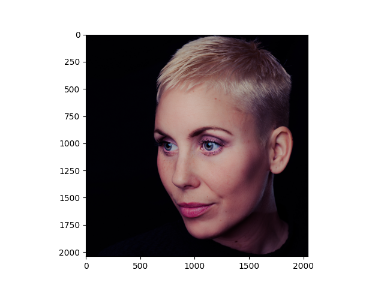
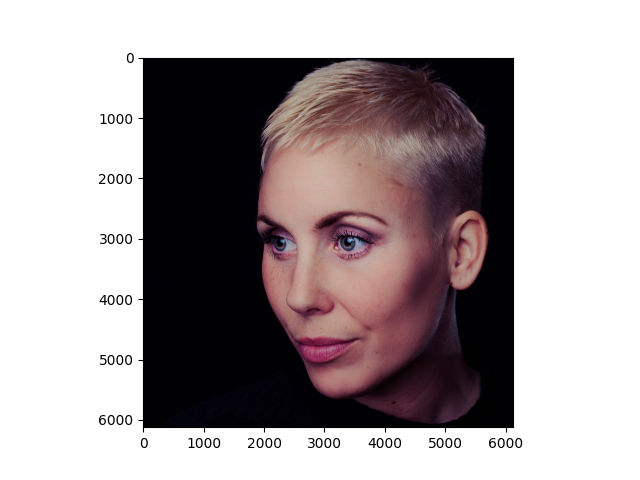
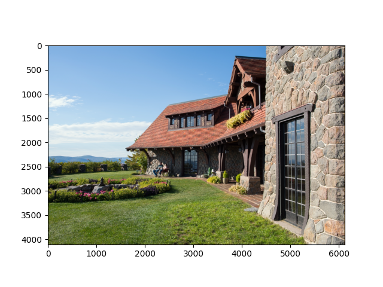

# Accelerating the Super-Resolution Convolutional Neural Network

**Replicating the results of this paper:** https://arxiv.org/pdf/1608.00367.pdf  
**Authors**: Chao Dong, Chen Change Loy, and Xiaoou Tang  
**Institution**Department of Information Engineering, The Chinese University of Hong Kong  

## Requirements

1. Python (I used 3.11.5)
2. NumPy version 1.26.3 or Newer
3. Pytorch 2.1.2 (with cuda)
4. Matplotlib.pyplot
5. Image from PIL 
6. os
7. Pathlib
8. glob
9. zipfile

## Model Architecture

**Structure:** Conv(5, d, 1) −> PReLU −> Conv(1, s, d) −> PReLU −> m×Conv(3, s, s) −> PReLU −> Conv(1, d, s) −> PReLU −> DeConv(9, 1, d)

**Differences**:  
Instead of using L2 loss, as used in the paper, I used L1 loss as "Using MSE or a metric based on MSE is likely to result in training finding a deep learning based blur filter, as that is likely to have the lowest loss and the easiest solution to converge to minimising the loss. A loss function that minimises MSE encourages finding pixel averages of plausible solutions that are typically overly smoothed and although minimising the loss, the generated images will have poor perceptual quality from a perspective of appealing to a human viewer."  

I opted to use L1 loss because "With L1 loss, the goal is the least absolute deviations (LAD) to minimise the sum of the absolute differences between the ground truth and the predicted/generated image. MAE reduces the average error, whereas MSE does not. Instead, MSE is very prone to being affected by outliers. For Image Enhancement, MAE will likely result in an image which appears to be a higher quality from a human viewer’s perspective."  

https://towardsdatascience.com/deep-learning-image-enhancement-insights-on-loss-function-engineering-f57ccbb585d7

## Results

**Note:** I havent had the time to train a scale of 2 or 4 yet as it takes all day but it is coming soon  

| Eval. Mat | Scale | Paper | Mine |
|-----------|-------|-------|-----------------|
| PSNR | 2 | 36.94 | x |
| PSNR | 3 | 33.06 | 32.05 |
| PSNR | 4 | 30.55 | x |

  
 

<table>
    <tr>
        <td>
Original
</td>
        <td>
BICUBIC x3
</td>
        <td>
FSRCNN x3
</td>
    </tr>
    <tr>
    	<td>
    		

    	</td>
    	<!-- <td>
    		

    	</td> -->
    	<td>
    		

    	</td>
    </tr>
    <tr>
        <td>
Original
</td>
        <td>
BICUBIC x3
</td>
        <td>
FSRCNN x3
</td>
    </tr>
    <tr>
    	<td>
    		

    	</td>
    	<!-- <td>
    		

    	</td> -->
    	<td>
    		

    	</td>
    </tr>
</table>

## File Overview
**notebooks**
- sandbox.ipynb  
    - Jupyter notebook that contains everything in one place from ingestion to predictions. This is what I used as a rough draft before restructuring into `.py` files

**utils**
- helpers.py  
    - Python file containing helper functions I either created or found to assist with this project.  
- dataset.py  
    - Python file containing the custom datasets needed to train this model. Includes the Train and Evaluation datasets as they require different things to function as needed. 
- model.py 
    - Python file that contains the model consisting of layers for feature extraction, shrinking, non-linear mapping, expanding, and deconvolution. Uses PReLU instead of ReLU as it is more stable and avoids 'dead features' caused by zero_grad. 

- train.py 
    - Python file that trains the model using methods train_step, test_step, and train. Evaluates the model using Peak Signal-to-Noise Ratio(PSNR) measured in db. 
