# Accelerating the Super-Resolution Convolutional Neural Network

**Replicating the results of this paper:** https://arxiv.org/pdf/1608.00367.pdf <br/>
**Authors**: Chao Dong, Chen Change Loy, and Xiaoou Tang <br/>
**Institution**: Department of Information Engineering, The Chinese University of Hong Kong <br/>

## Features

- Fast super-resolution using FSRCNN (2×, 3×, 4× upscaling)
- Web interface for easy image processing
- Docker containerization for consistent deployment

## How To Run

**With Docker Compose (recommended)**
```bash
cd app
docker compose up --build
```
Then navigate to `http://localhost:8000` in your browser.

**With Docker (alternative)**
```bash
cd app
docker build . -t fsrcnn-app
docker run -p 8000:8000 fsrcnn-app
```

**Without Docker (not recommended)**
```bash
cd app
pip install -r requirements.txt
python api/app.py
```

## Requirements

1. Python==3.11.5
2. NumPy==1.26.3
3. PyTorch==2.1.2
4. torchvision==0.16.2
5. Flask>=3.0.2
6. Pillow==10.2.0


## Results

All three scales (2×, 3×, 4×) are trained and available in the web application.

| Eval. Mat | Scale | Paper | Mine |
|-----------|-------|-------|-----------------|
| PSNR | 2 | 36.94 | 34.77 |
| PSNR | 3 | 33.16 | 32.05 |
| PSNR | 4 | 30.55 | 30.82 |

<!--  <br/>
<br/>
 -->

<table>
    <tr>
        <td><center>Original</center></td>
		<td><center>Original Cropped</center></td>
        <td><center>BICUBIC x3</center></td>
        <td><center>FSRCNN x3</center></td>
    </tr>
    <tr>
    	<td>
    		<center></center>
    	</td>
		<td>
    		<center>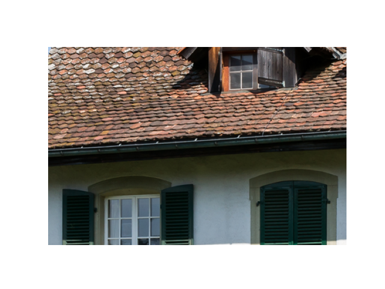</center>
    	</td>
    	<td>
    		<center>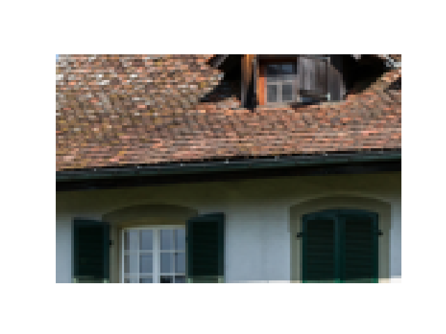</center>
    	</td>
    	<td>
    		<center>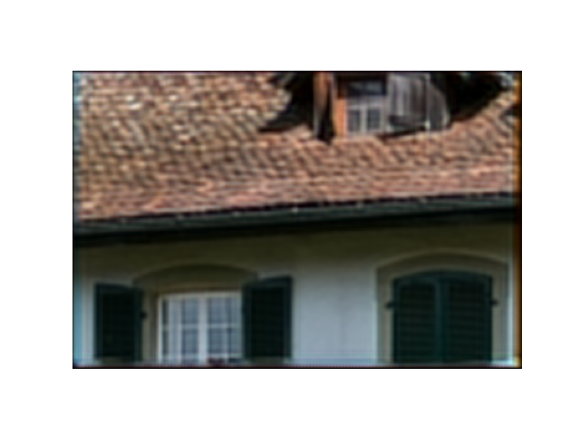</center>
    	</td>
    </tr>
    <tr>
        <td><center>Original</center></td>
        <td><center>BICUBIC x3</center></td>
        <td><center>FSRCNN x3</center></td>
    </tr>
    <tr>
    	<tr>
    	<td>
    		<center>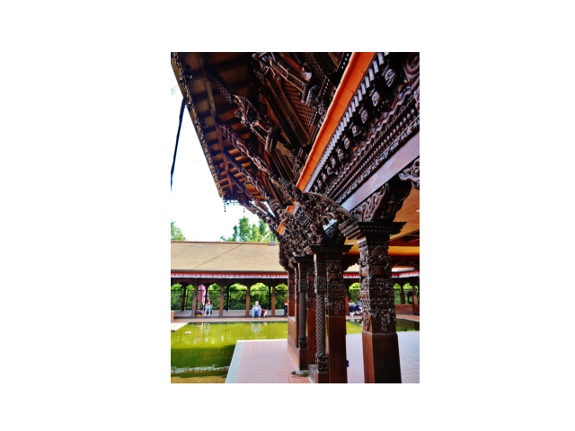</center>
    	</td>
		<td>
    		<center>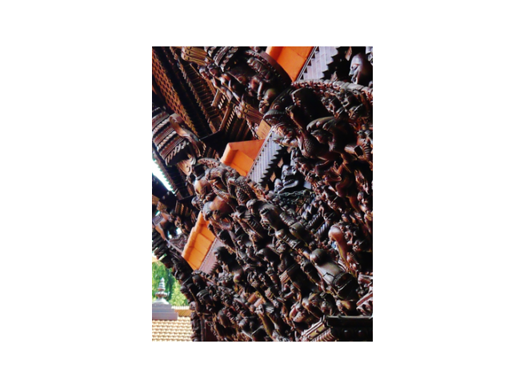</center>
    	</td>
    	<td>
    		<center>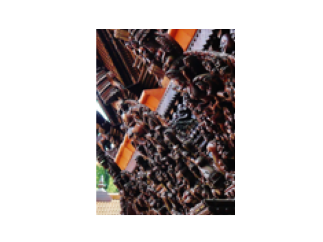</center>
    	</td>
    	<td>
    		<center>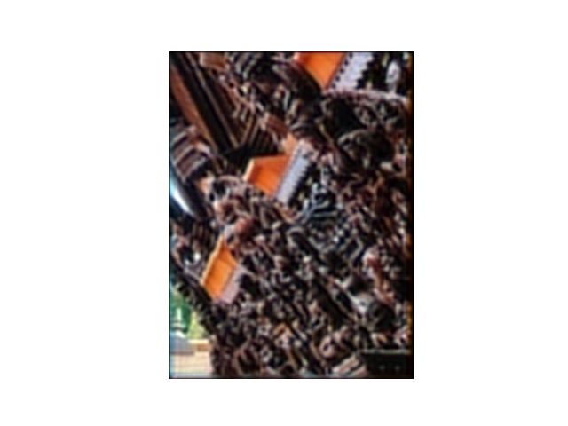</center>
    	</td>
    </tr>
</table>

<br/>

### Mean Squared Error vs Mean Absolute Error Comparison

<table>
    <tr>
        <td><center>Original</center></td>
        <td><center>Original Cropped</center></td>
        <td><center>BICUBIC x3</center></td>
        <td><center>FSRCNN x3 MSE</center></td>
        <td><center>FSRCNN x3 MAE</center></td>
    </tr>
    <tr>
    	<td>
    		<center>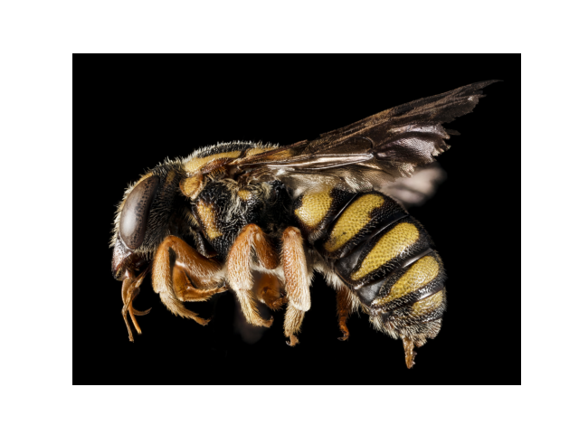</center>
    	</td>
        <td>
    		<center></center>
    	</td>
    	<td>
    		<center>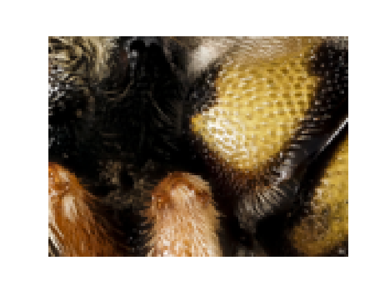</center>
    	</td>
        <td>
    		<center>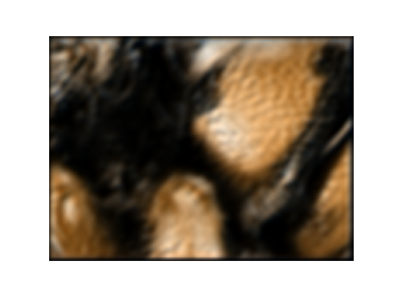</center>
    	</td>
    	<td>
    		<center>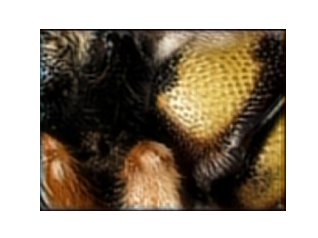</center>
    	</td>
    </tr>
</table>

## Model Architecture

**Structure:** Conv(5, d, 1) −> PReLU −> Conv(1, s, d) −> PReLU −> m×Conv(3, s, s) −> PReLU −> Conv(1, d, s) −> PReLU −> DeConv(9, 1, d)

**Differences**: <br/>
Instead of using L2 loss, as used in the paper, I used L1 loss as "using MSE or a metric based on MSE is likely to result in training finding a deep learning based blur filter, as that is likely to have the lowest loss and the easiest solution to converge to minimising the loss. A loss function that minimises MSE encourages finding pixel averages of plausible solutions that are typically overly smoothed and although minimising the loss, the generated images will have poor perceptual quality from a perspective of appealing to a human viewer." <br/>

I opted to use L1 loss because "with L1 loss, the goal is the least absolute deviations (LAD) to minimise the sum of the absolute differences between the ground truth and the predicted/generated image. MAE reduces the average error, whereas MSE does not. Instead, MSE is very prone to being affected by outliers. For Image Enhancement, MAE will likely result in an image which appears to be a higher quality from a human viewer’s perspective." <br/>

https://towardsdatascience.com/deep-learning-image-enhancement-insights-on-loss-function-engineering-f57ccbb585d7


## Web App Demo
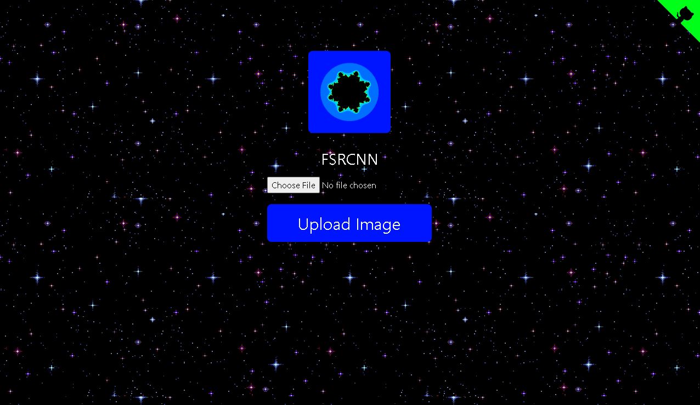

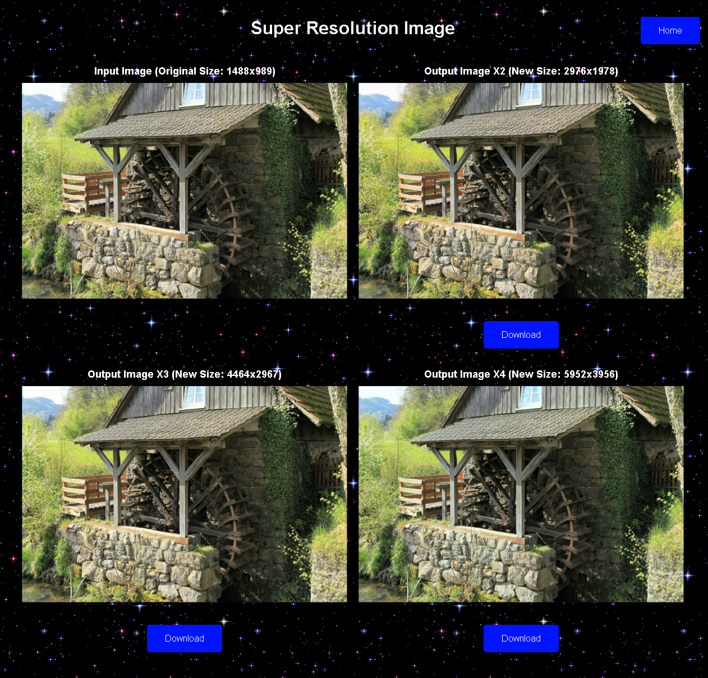

## File Overview

### `/app` - Web Application
- **api/app.py** - Flask application with routes for image upload, processing, and download. Loads and compiles FSRCNN models at startup.
- **api/utilities.py** - Core upscaling logic and FSRCNN model architecture. Handles image preprocessing, inference, and saving.
- **api/templates/** - Jinja2 templates for the web interface (index.html for upload, result.html for results).
- **api/static/** - Static assets (CSS, input/output images, demo images).
- **api/models/** - Pre-trained FSRCNN model weights for 2×, 3×, and 4× scales.
- **Dockerfile** - Container configuration with Python 3.11, PyTorch, and g++ for torch.compile optimization.
- **compose.yaml** - Docker Compose configuration for easy deployment.
- **requirements.txt** - Python dependencies (PyTorch, Flask, Pillow, etc.).

### `/utils` - Training Utilities
- **helpers.py** - Helper functions for training and evaluation.
- **datasets.py** - Custom PyTorch datasets for training and evaluation (DIV2K dataset).
- **models.py** - FSRCNN model architecture with PReLU activation (avoids dead features from ReLU).
- **train.py** - Training pipeline with train_step, test_step, and PSNR evaluation.
- **test.py** - Model testing and evaluation utilities.
- **save_model.py** - Model checkpoint saving utilities.

### `/notebooks` - Development
- **01_sandbox.ipynb** - Initial experimentation notebook.
- **02_sandbox.ipynb** - Complete pipeline from ingestion to predictions (rough draft before restructuring).

### `/images` - Training Data
- **train_images/DIV2K_train_HR/** - High-resolution training images from DIV2K dataset.
- **valid_images/DIV2K_valid_HR/** - Validation images.

### `/models` - Saved Model Weights
Pre-trained FSRCNN models for different scales and training configurations.


